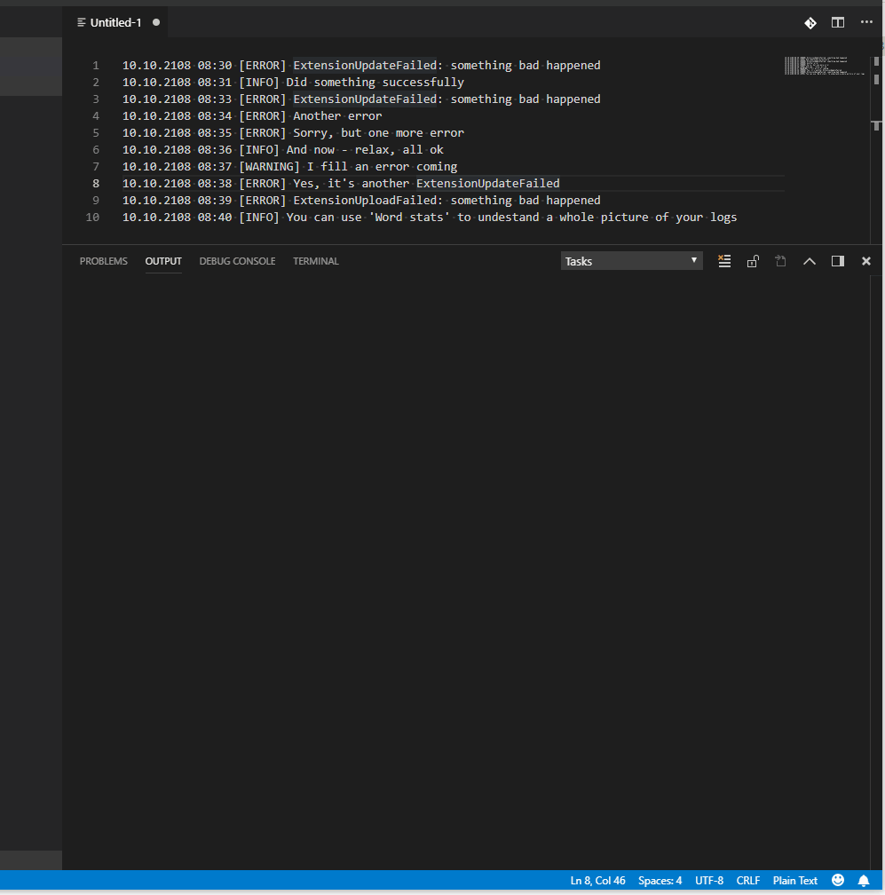
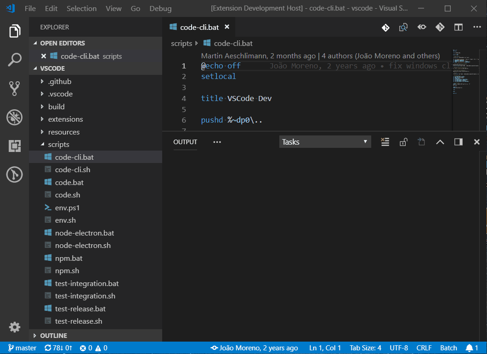

## Features

In the 'Command palette' (Ctrl + Shift + P) run 'Calculate word stats (current file)' command. Results will be presented in 'Word stats' terminal.

Or you can find "Calculate word stats (folder)" menu item in the context menu for the folder in the Explorer. Results will be presented in 'Word stats' terminal.

